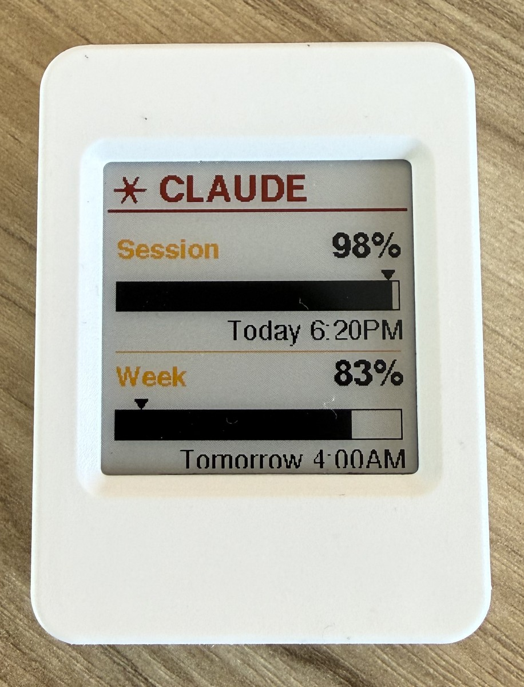

# Clawdmeter (e-paper port)

A Claude Code usage dashboard on a small e-paper panel, driven over BLE by a
macOS daemon. Spiritual fork of [HermannBjorgvin/Clawdmeter](https://github.com/HermannBjorgvin/Clawdmeter),
re-targeted from a 480×480 AMOLED with LVGL animations to a 200×200 4-colour
e-paper that can only do full refreshes.



The device sits on your desk and shows:

- **Session** — how much of the 5-hour budget is left, plus the wall-clock time
  it resets ("Today 1:20PM", "Tomorrow 4:00AM", "Sun 8:00AM").
- **Week** — same but for the 7-day budget.
- A small **▼ tick** above each bar marks how much *time* is left in the
  period, so you can eyeball "am I pacing ahead of or behind the clock?"

Refreshes every 5 min from the daemon, but the EPD only physically updates
when something a user can actually see has changed (hour bucket flips, % moves
to a new integer, status flips). On a typical day this means 3–4 refreshes,
not 288.

---

## Hardware

**[Waveshare ESP32-S3-ePaper-1.54G](https://www.waveshare.com/wiki/ESP32-S3-ePaper-1.54G)**
— ESP32-S3 + 200×200 4-colour (B/W/Y/R) e-paper using the JD79667 controller.
Datasheet pinout (verified against `waveshareteam/ESP32-S3-ePaper-1.54G`):

| Function | GPIO | Notes |
|----------|------|-------|
| EPD PWR (3V3_EN) | 6 | active-LOW — drive LOW to power the panel |
| EPD BUSY | 8 | input |
| EPD RST  | 9 | output |
| EPD DC   | 10 | output |
| EPD CS   | 11 | output |
| EPD SCK  | 12 | SPI |
| EPD MOSI | 13 | SPI |
| **VBAT_PWR** (BAT_KEY) | **17** | **active-HIGH self-power latch** — drive HIGH in `setup()` or the board dies the moment the PWR button is released on battery |
| PWR button | 18 | input pull-up, momentary, also gates battery power-on |
| BOOT button | 0 | input pull-up, also used for ESP32 download mode |
| BAT_ADC | 4 | divider, VBAT = ADC × 2 |
| Audio (unused) | 42 | active-LOW |
| Charger | ETA6098 | USB-C in, JST 1.25 mm Li-ion out |

Soft-power model on this board:

1. PWR button briefly closes the battery rail.
2. ESP32 boots, runs `setup()`.
3. Firmware **must** `digitalWrite(17, HIGH)` to latch the rail on; otherwise
   the moment the user lets go of PWR, VBAT drops and the board powers off.
4. To shut down on battery: pull GPIO 17 LOW.

The first cut of the firmware skipped step 3 entirely, which is why the
"works on USB, dies on battery" pathology took a few hours to track down.

---

## Architecture

```
┌──────────────────────┐                        ┌──────────────────────┐
│   macOS daemon       │                        │      ESP32-S3        │
│ ─────────────────    │   BLE (NimBLE GATT)    │ ─────────────────    │
│ poll Anthropic API   │ ──────────────────────►│ "Claude Controller"  │
│ every 5 min          │   { "s":18, "w":17,    │ JD79667 + e-paper    │
│ ratelimit-* headers  │     "sa":"Today 1PM",  │ render usage dash    │
│ → JSON over GATT     │     "wa":"Sun 8AM" }   │ self-power latch     │
└──────────────────────┘                        └──────────────────────┘
```

- The macOS side runs as a `LaunchAgent`-managed `.app` bundle, kept alive in
  the background so BLE permissions stay attached to a bundle ID rather than
  to `python3` (see "TCC notes" below for why this matters).
- The ESP32 side is a NimBLE GATT server. Same UUIDs as upstream Clawdmeter
  so existing daemons / clients stay compatible.
- The daemon never reads from the device — it's a push-only channel, written
  to the RX characteristic on every poll.

### BLE protocol

| UUID | Direction | Use |
|------|-----------|-----|
| `4c41555a-4465-7669-6365-000000000001` | service | "Clawdmeter data" |
| `4c41555a-4465-7669-6365-000000000002` | RX (write) | JSON payload from daemon |
| `4c41555a-4465-7669-6365-000000000003` | TX (notify) | reserved, unused for now |

JSON wire format:

```json
{
  "s":  18,                "sr": 19,    "sa": "Today 1:20PM",
  "w":  17,                "wr": 899,   "wa": "Tomorrow 4:00AM",
  "st": "allowed",         "ok": true
}
```

| Field | Meaning |
|-------|---------|
| `s` / `w` | usage utilisation %, 5-hour and 7-day windows |
| `sr` / `wr` | minutes until reset (used for the ▼ tick position) |
| `sa` / `wa` | wall-clock label for the reset moment (firmware has no RTC) |
| `st` | rate-limit status string (`"allowed"` / etc.) |
| `ok` | did the daemon's poll succeed |

---

## macOS daemon

```
daemon/
  claude_usage_daemon.py            the actual daemon
  install.sh                        builds the .app bundle and installs LaunchAgent
  com.user.claude-usage-daemon.plist  LaunchAgent plist template
  requirements.txt                  bleak + httpx
```

### What `install.sh` produces

```
/Applications/ClawdmeterDaemon.app/
└── Contents/
    ├── Info.plist                  (incl. NSBluetoothAlwaysUsageDescription,
    │                                LSUIElement so no Dock icon)
    ├── MacOS/
    │   └── ClawdmeterDaemon        small Mach-O C launcher
    └── Resources/
        ├── claude_usage_daemon.py
        └── .venv/                  bundle-internal Python interpreter
                                    with bleak + httpx pre-installed

~/Library/LaunchAgents/com.user.clawdmeter-daemon.plist
```

The launcher is a tiny C program because shell-shebang launchers behave weirdly
with TCC — the bash/zsh interpreter doesn't get attributed to the bundle, so
macOS routes the Bluetooth prompt to the wrong identity. A real Mach-O at
`Contents/MacOS/<CFBundleExecutable>` solves that.

### Install

```bash
cd daemon
./install.sh
```

Then **launch it once manually** so macOS shows the Bluetooth permission
prompt — click **Allow**:

```bash
open /Applications/ClawdmeterDaemon.app
```

After that the LaunchAgent will start it on every login.

### Logs

```
~/Library/Logs/claude-usage-daemon/stdout.log
~/Library/Logs/claude-usage-daemon/stderr.log
```

### TCC notes (why the architecture is so baroque)

macOS's TCC subsystem decides which app gets the "Bluetooth" permission based
on the *bundle identity* of the process that calls CoreBluetooth, not the
binary path. Three landmines came up:

1. **Apple's `/usr/bin/python3` framework auto-execs into `Python.framework/.../Python.app/Contents/MacOS/Python`**
   the moment it starts. That Python.app's Info.plist has no
   `NSBluetoothAlwaysUsageDescription`, so TCC silently refuses *and never
   prompts*. The fix: copy `Python.app/Contents/MacOS/Python` (the real
   interpreter, not the launcher stub) into our `.app/.venv/bin/`,
   `install_name_tool` the `@executable_path/../../../../Python3` dylib
   reference to an absolute path, and re-sign.
2. **Bleak's `CentralManagerDelegate.__init__` waits only 1 second for the
   delegate to fire**, then bails with `BleakError("BLE is not authorized")`
   or `("Bluetooth device is turned off")`. The first time macOS shows a
   prompt the user hasn't clicked yet, so the daemon dies before they can.
   The bundle install patches that wait to 120 s.
3. **NimBLE's `onWrite` callback runs on its own task** — calling
   `display_render()` directly from there races against the main loop's
   draws (boot screen, BOOT-button redraw). The firmware was sporadically
   leaving the panel mid-refresh. Fix: `on_state` just sets a dirty flag;
   the main loop is the only writer to the EPD.

If you ever see "still says 'waiting for daemon' but daemon logs show
`Sending`" — that's the race; check `g_state_dirty` plumbing.

---

## Firmware

```
firmware/
  platformio.ini                   target = waveshare-esp32s3-epaper-154g
  src/
    main.cpp                       boot, BAT_KEY latch, buttons, dispatch
    ble_service.{h,cpp}            NimBLE GATT server + JSON parse
    display.{h,cpp}                Adafruit_GFX 2bpp canvas + layout
    epd_1in54g.{h,cpp}             JD79667 init + fast LUT + refresh
    usage_state.h                  shared struct, equality bucket for dedup
```

### Build / flash

```bash
brew install platformio              # or: pipx install platformio
cd firmware
pio run
pio run -t upload --upload-port /dev/cu.usbmodem*
pio device monitor -b 115200 --port /dev/cu.usbmodem*
```

If `--upload-port` is omitted, PlatformIO will sometimes pick
`/dev/cu.Bluetooth-Incoming-Port` first and timeout — always specify the
USB CDC port explicitly.

### Buttons (built into the board)

- **BOOT (GPIO 0)** — short press redraws the EPD from the last cached state,
  bypassing the dedup check. Handy after waking the panel from sleep or
  while iterating on UI.
- **PWR (GPIO 18)** — long press (≥ 1 s) writes "powered off" to the EPD and
  drives `VBAT_PWR` LOW. On battery the board really does shut off. On USB
  the rail keeps the board alive but firmware sits in an idle loop.

### Refresh strategy

- **Fast LUT** (`epd_init_fast()`): the JD79667 has a vendor "fast" init
  sequence (`0xE0 0x02 / 0xE6 0x5D / 0xA5 0x00`) that completes in ~15 s
  with noticeably fewer flash cycles, at the cost of slightly muted
  colour. The dashboard always uses this.
- **Dedup** (`UsageState::operator==`): two states compare equal if their
  *displayed* values are identical. Concretely, reset countdowns above
  60 min compare by hour bucket; under 60 min they compare per minute.
  Combined with the daemon's 5 min poll, this gets the panel down to a
  handful of refreshes per day rather than one per poll.
- **Force redraw**: the BOOT button sets a `g_force_redraw` flag that
  bypasses dedup for one cycle — used for manual debugging or to clear
  a ghost.

### UI

```
┌────────────────────┐
│  ✱ CLAUDE          │  red asterisk + brand
│════════════════════│  red rule
│                    │
│  Session     82%   │  yellow label / 12 pt colour-tier %
│              ▼     │  ▼ = % of period remaining (time)
│ ████████████░░░░░  │  filled = % budget remaining (capacity)
│        Today 1:20PM│  wall-clock reset
│ ────────────────── │  yellow rule
│  Week         83%  │
│   ▼                │
│ █████████████████  │
│    Tomorrow 4:00AM │
└────────────────────┘
```

Bar and tick share a frame: both deplete left-to-right. If the **▼ tick is
inside the fill**, you're pacing fine (you have more budget left than time
left). If the **▼ tick falls past the fill into the white**, you're burning
budget faster than the clock.

Colour tiers follow `colour_for_remaining()`:

- `> 60%` remaining → black (healthy)
- `≤ 60%` remaining → yellow (notable)
- `≤ 30%` remaining → red (about to be capped)

---

## Known limitations

- **Ad-hoc signed** — the .app is `codesign --sign -`, not a real Developer
  ID. Gatekeeper says "rejected" but TCC still prompts and grants on first
  run; the permission is sticky across reboots. If you ever delete and
  reinstall the bundle, you may have to re-grant.
- **No partial refresh** — JD79667 BWRY panels just don't do it cleanly.
  Every visible change is a full ~15 s refresh.
- **Reset cadence is hard-coded** — `SESSION_PERIOD_MIN = 300`,
  `WEEKLY_PERIOD_MIN = 7 * 24 * 60`. If Anthropic ever changes the
  rate-limit window cadence the tick marker math will need bumping.
- **No RTC on the device** — wall-clock labels are pre-formatted on the
  daemon side and shipped over BLE. If the daemon stops, the strings stop
  refreshing along with everything else.

## Credit

- Upstream protocol & idea: [HermannBjorgvin/Clawdmeter](https://github.com/HermannBjorgvin/Clawdmeter)
- Board + reference driver: [waveshareteam/ESP32-S3-ePaper-1.54G](https://github.com/waveshareteam/ESP32-S3-ePaper-1.54G)
- BLE on macOS: [hbldh/bleak](https://github.com/hbldh/bleak)
- BLE on ESP32: [h2zero/NimBLE-Arduino](https://github.com/h2zero/NimBLE-Arduino)
